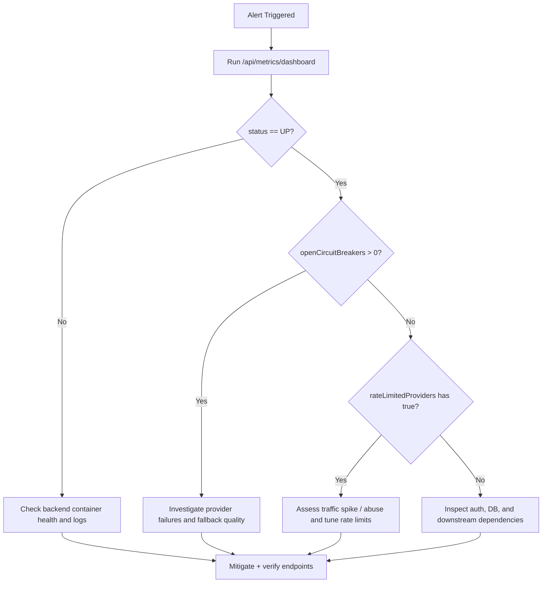

# Incident Runbook

This runbook covers triage and response for production incidents in the trading platform.

## Severity levels

- **SEV1**: Full outage or critical security issue
- **SEV2**: Major feature unavailable or severe degradation
- **SEV3**: Partial impact or minor degradation

## 1. Immediate response (first 15 minutes)

1. Declare incident in ops channel and assign incident commander
2. Capture start time, impacted features, and user-facing symptoms
3. Check service status and metrics:
   - `GET /api/metrics/summary`
   - `GET /api/metrics/circuit-breakers`
  - `GET /api/metrics/dashboard`
4. Determine blast radius:
   - auth/login
   - watchlists/trading endpoints
   - quote providers / data freshness

## 2. Containment actions

- **Auth/security anomaly**:
  - Revoke active sessions for affected users
  - Temporarily enforce stricter auth controls
- **Provider instability**:
  - Inspect provider circuit breaker status
  - Fail over to alternate providers and monitor fallback quality
- **Traffic spike / abuse**:
  - Increase public-route rate-limit strictness
  - Apply temporary edge/network throttling if needed

## 3. Diagnosis checklist

- Inspect backend logs for error bursts and stack traces
- Validate database health and connection pool saturation
- Validate API provider usage and rate-limit state
- Validate consolidated dashboard state (`status`, `openCircuitBreakers`, `rateLimitedProviders`)
- Confirm frontend reaches expected backend routes
- Verify latest deployment/rollback status

## 3.1 Incident response flow

## 4. Communication

- Publish status updates every 15-30 minutes for SEV1/SEV2
- Include:
  - current impact
  - mitigation in progress
  - next expected update time

## 5. Recovery and verification

- Confirm affected endpoints return healthy responses
- Re-run focused verification:
  - auth/login
  - watchlist CRUD
  - order create/list
  - market/metrics endpoints
- Monitor for at least one full alerting window after mitigation

## 6. Post-incident actions

- Complete RCA within 2 business days for SEV1/SEV2
- Document timeline, root cause, and contributing factors
- Add preventive actions with owners and due dates
- Update this runbook and `PRODUCTION_CHECKLIST.md` if gaps were found
