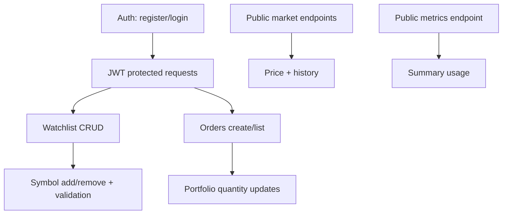
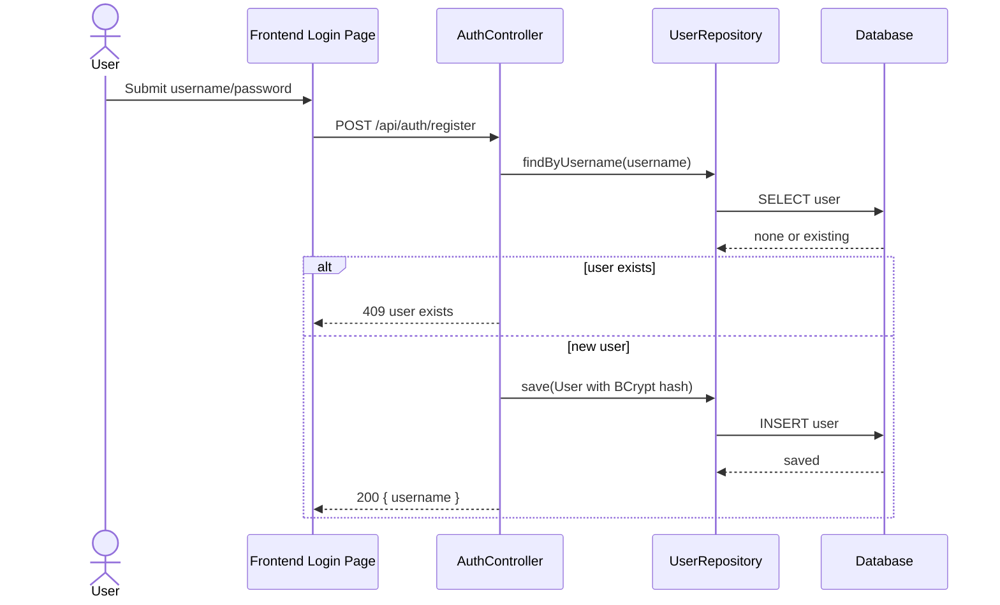
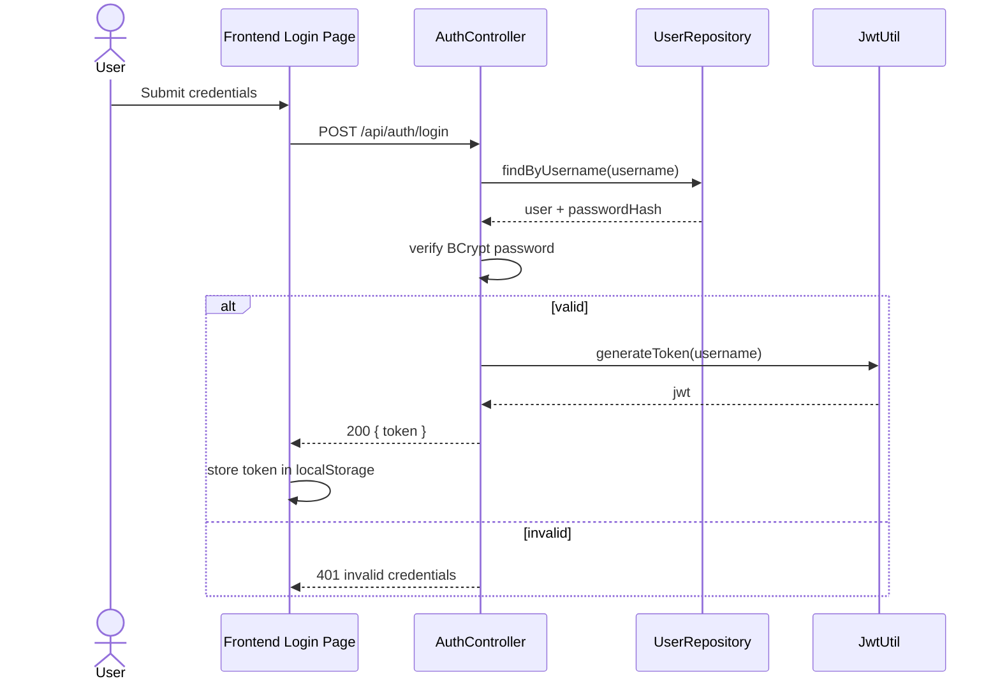
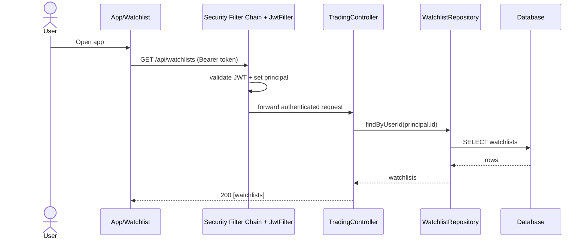
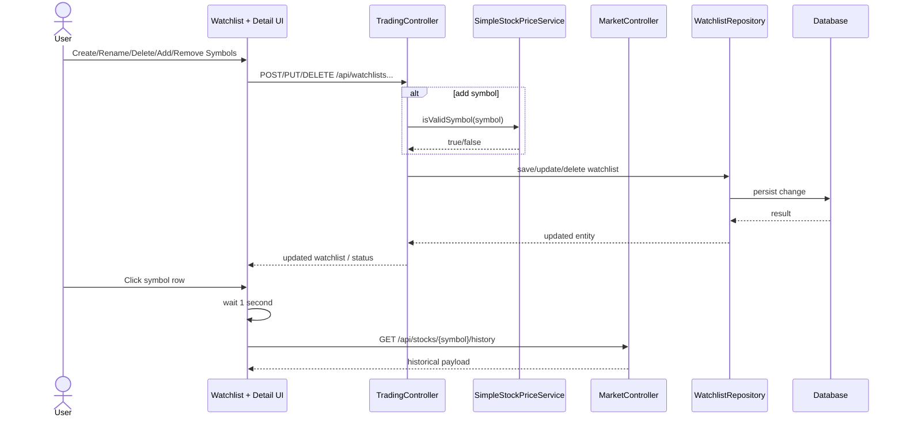
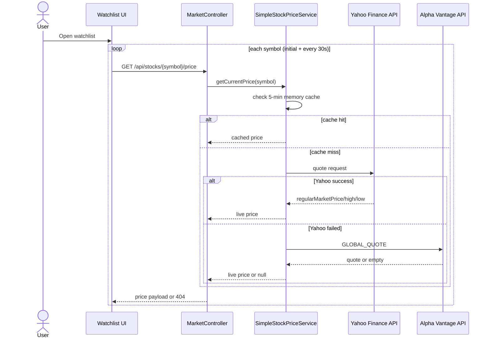
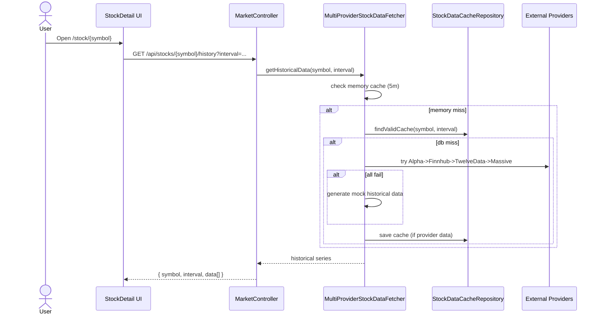
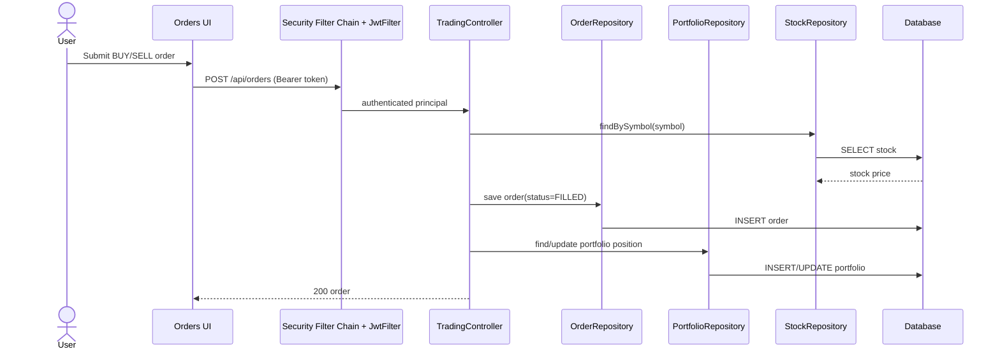
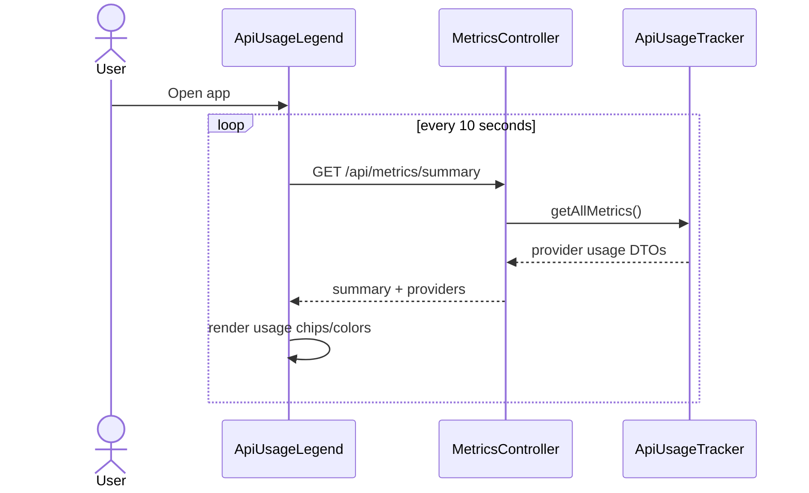
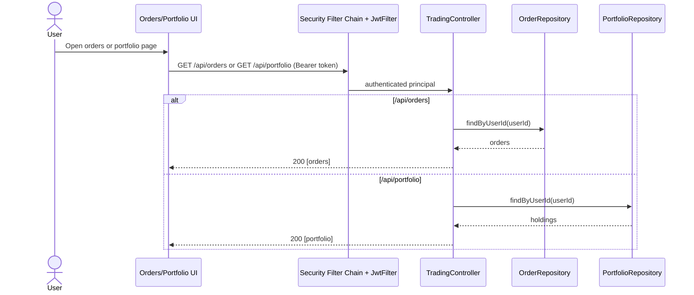

# Trading App (React + Spring Boot + MariaDB)

This repository is a small trading app scaffold (watchlist + simple stock API) intended as a learning replica of a retail trading UI. It includes:

- Frontend: React + Vite (in `frontend/`)
- Backend: Spring Boot (in `backend/`) targeting Java 25
- Database: MariaDB (configure connection in `backend/src/main/resources/application.properties`)

Important notes
- The project `pom.xml` sets `<java.version>25`. You must have a JDK 25 installed to build and run the backend. If your environment does not support Java 25, change the `java.version` in `pom.xml` to a supported version and update the compiler plugin accordingly.
- Start a MariaDB server and create a database `tradingdb` or adjust `spring.datasource.url`.

Run backend (from project root):

```bash
mvn -f pom.xml spring-boot:run
```

Run frontend:

```bash
cd frontend
npm install
npm run dev
```

This scaffold is intentionally minimal. If you want, I can:
- Add authentication, orders, and portfolio models
- Add Docker Compose for MariaDB + backend + frontend
- Replace in-memory seed with market data ingestion

Authentication & Orders (demo)

This scaffold adds a simple authentication demo and order/portfolio models:

- Register: `POST /api/auth/register` with JSON `{ "username": "u", "password": "p" }`
- Login: `POST /api/auth/login` with JSON `{ "username": "u", "password": "p" }` (returns a demo token)
- Place order: `POST /api/orders` with header `Authorization: Bearer <token>` and body `{ "symbol":"AAPL","quantity":1,"side":"BUY" }`
- List orders: `GET /api/orders` with header `Authorization: Bearer <token>`
- Portfolio: `GET /api/portfolio` with header `Authorization: Bearer <token>`

The frontend includes a simple login form and an Orders page that uses JWT bearer authentication.

Docker (recommended)

Build and run everything with Docker Compose (recommended):

```bash
docker compose up --build
```

This starts MariaDB, the backend (port 8080) and the frontend served by nginx (port 3000).

## Current UI Behavior

- `/` renders **Watchlist (left)** and **Stock Detail (right)** on the same page.
- Selecting a symbol in watchlist updates stock detail after a **1-second delay**.
- Watchlist supports sorting by clicking table headers (`Symbol`, `Price`).
- Row-level remove action is an **`×` icon on hover** (no persistent `Remove` button).
- Stock detail symbol search input is removed in combined view; symbol source is watchlist selection.

## Test Coverage and Commands

Frontend (unit + integration):

```bash
cd frontend
npm run test
```

Frontend browser E2E (headed by default, slow interactions):

```bash
cd frontend
npm run test:e2e
```

Backend integration + API E2E:

```bash
cd backend
mvn test
```

Backend API E2E scenarios are covered in:

- `backend/src/test/java/com/example/trading/integration/TradingApplicationIntegrationTest.java`
- `backend/src/test/java/com/example/trading/integration/BackendApiEndToEndTest.java`

### API E2E Coverage Map



## Full Code Documentation

Detailed architecture and file-level documentation is available in:

- [CODE_DOCUMENTATION.md](CODE_DOCUMENTATION.md)

## Sequence Diagrams (All Major Use Cases)

### 1) User Registration



### 2) User Login (JWT)



### 3) Authenticated Watchlist Fetch



### 4) Watchlist CRUD + Symbol Management + Delayed Detail Sync



### 5) Live Price Fetch for Watchlist Rows



### 6) Stock Detail Historical Chart (Fallback + Caching)



### 7) Place Order and Update Portfolio



### 8) API Metrics Footer Polling



### 9) Read Orders and Portfolio


